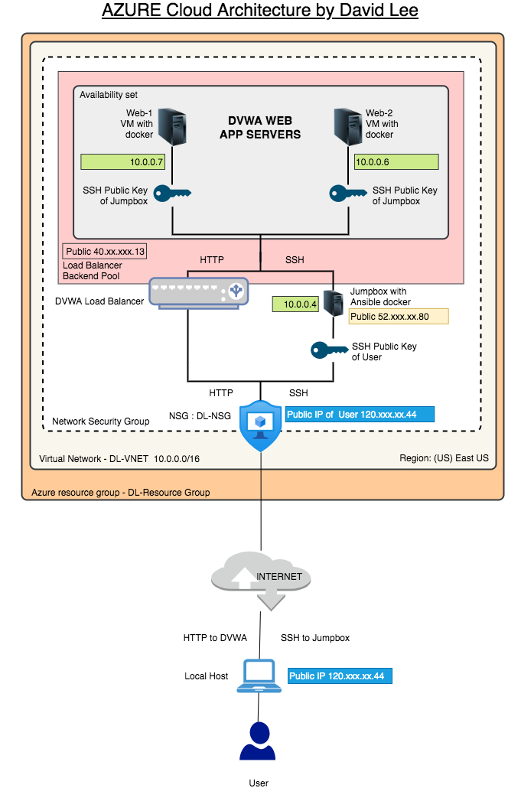

## Cloud Security Infrastructure

#### Background

- Create a highly available web server for XCorp's Red Team to use for testing and training.

- Your lead cloud administrator has asked for a diagram of the Network you created to keep for documentation and company records.

- Your task: Use [draw.io](https://app.diagrams.net/) to create a detailed diagram of your cloud infrastructure.

### Requrement

You should have:
- A total of 3 VMs running DVWA (Damn Vulnerable Web Application).

- All 3 VMs receiving traffic from your load balancer.

### Your Goal 

When you are finished with this assignment, you should have a network diagram that shows your entire cloud setup, including your Ansible jump box and the Docker containers running on each VM.

This document can be used as part of a portfolio to demonstrate your ability.

### Instructions

Use a free account at [draw.io](https://app.diagrams.net/) to diagram the entire cloud network you have created.

    - Your diagram should show the following:
        - Azure resource group
        - Virtual network with IP address range
        - Subnet range
        - Flow of specific traffic (e.g., HTTP, SSH)
        - Security group blocking traffic
        - Load balancer
        - All 3 VMs that you have launched 
        - Where Docker and Ansible are deployed

