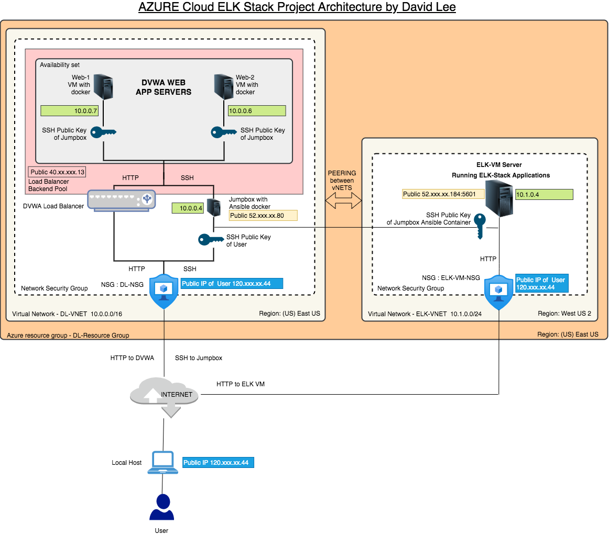
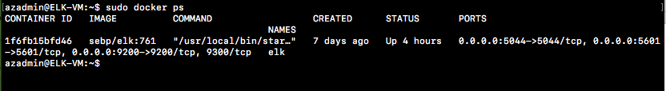

## Automated ELK Stack Deployment. 

This project involved building and integrating an ELK server which allows users to easily monitor the vulnerable VMs for changes to the logs and system metrics. Kibana from the ELK stack is used to visualize the data logged by the Filebeat and Metricbeat tools.

**The files in this repository were used to configure the network depicted below.**



These files have been tested and used to generate a live ELK deployment on Azure. They can be used to either recreate the entire deployment pictured above. Alternatively, select portions of the playbook file may be used to install only certain pieces of it, such as Filebeat.

  - [install-elk.yml](Ansible/install-elk.yml)

## This document contains the following details:  

### Content
1. <a href="#Description">Description of the Topology</a>
1. <a href="#Access">Access Policies</a>
1. <a href="#ELK">ELK Configuration</a>
1. <a href="#Target">Target Machines & Beats</a>
1. <a href="#How">Using the Playbook</a>
1. <a href="#Bonus">Bonus Material</a>

### <span id="Description">1. Description of the Topology</span>
The main purpose of this network is to expose a load-balanced and monitored instance of DVWA, the D*mn Vulnerable Web Application.

Load balancing ensures that the application will be highly effective in distributing load(network traffic) across two VMs, in addition to restricting traffic to the network. This is to ensure that no single sever bears most of the traffic load.

- Most important security aspect of the load balancer is that it defends company against distributed denial-of-service (DDoS) attacks with it's off-loading funtion. By shifting attack traffic from the corporate server to public cloud provider the load balancer greatly improves the accessibility of the corporate server.

- The main advantage of Jump Box is that it prevents all Azure VM's to expose to the public.

Integrating an ELK server allows users to easily monitor the vulnerable VMs for changes to the logs and system metrics. Kibana from the ELK stack is used to visualize the data logged by the Filebeat and Metricbeat tools.

- Filebeat watch changes in logs specific to the filesystem, including which files have changes and when.
- Metricbeat records system and service statistics such as uptime, CPU and memory.

The configuration details of each machine may be found below.

| Name     | Function     | IP Address | Operating System |
|----------|--------------|------------|------------------|
| Jump Box | Gateway      | 10.0.0.4   | Ubuntu V20.04    |
| Web-1    | VM Webserver | 10.0.0.7   | Ubuntu V20.04    |
| Web-2    | VM Webserver | 10.0.0.6   | Ubuntu V20.04    |
| ELK-VM   | ELK Server   | 10.1.0.4   | Ubuntu V20.04    |

---
### <span id="Access">2. Access Policies</span>

The machines on the internal network are not exposed to the public Internet. 

Only the Jump Box machine can accept connections from the Internet. Access to this machine is only allowed from the following IP address:

- User Router IP (120.xx.xx.44)

Machines within the network can only be accessed by Jump Box and VMs.

- Machine allowed to access the ELK VM is the Jump Box with the local IP address 10.0.0.4

A summary of the access policies in place can be found in the table below.

| Name     | Publicly Accessible | Allowed IP Addresses |
|----------|---------------------|----------------------|
| Jump Box | Yes                 | 120.xxx.xx.44        |
| Web-1    | No                  | 10.0.0.4             |
| Web-2    | No                  | 10.0.0.4             |
| ELK-VM   | No                  | 10.0.0.4             |


---
### <span id="ELK">3. Elk Configuration</span>

Ansible was used to automate configuration of the ELK machine. No configuration was performed manually, which is advantageous because it frees up the valueable time for the system administors to focus on more important tasks. By using the configuration feature of Ansible called playbook is used to create automated tasks in a file called .yml that can instantly deploy required applications and configurations across multiple servers. 

The playbook implements the following tasks:

### Steps of ELK Installation playbook.

**1.** Install Docker container (name: docker.io)

**2.** Install package manager for python library (name: python3-pip)

**3.** Install docker python module (name: docker)

**4.** Increase virtual memory (command: sysctl -w vm.max_ map_ count=262144)

**5.** Pull docker web container and expose the ports (name: sebp/elk:761)
       
       exposed ports are 5601(Kibana), 9200(Elastic), 5044(Logstash)

**6.** Enable service docker on boot

The following screenshot displays the result of running `docker ps` after successfully configuring the ELK instance.



---
### <span id="Target">4. Target Machines & Beats</span>
This ELK server is configured to monitor the following machines:

| Name     | Function         | IP Address   |
|----------|------------------|--------------|
| Web-1    | VM Server        | 10.0.0.7     |
| Web-2    | VM Serve         | 10.0.0.6     |

We have installed the following Beats on these machines:

* Filebeat
* Metricbeat

These Beats allow us to collect the following information from each machine:

- Filebeat: Filebeat is designed to ship log files you specify to Logstach for more advanced professing or directly into Elasticsearch for indexing. Usual location in which filebeat searches for log files is /var/log/*.log and /var/log/apache2/*

- Metricbeat: Metricbeat collects metrics and statistics from servers and system services running such as Apache, MySQL, System etc and forward them to Elasticsearch, Logstash, Redis, or Kafka. Common metrics that are collected are CPU Usage, CPU Load Average, Memory Usage, and System Uptime.

---
### <span id="How">5. Using the Playbook</span>
In order to use the playbook, you will need to have an Ansible control node already configured. Assuming you have such a control node provisioned: 

SSH into the control node and follow the steps below:

- Copy the **filebeat-config.yml** file to **/etc/ansible/files/** folder on the Jumpbox ansible container.
- Update the **hosts** files in **/etc/ansible/** folder to include two IP addresses of **Web-1** (10.0.0.7) and **Web-2** (10.0.0.6) VMs under the **[webservers]** section.
- Run the **filebeat-playbook.yml**, and navigate to **Kibana website specifying the port 5601** to check that the installation worked as expected.
- Repeat above steps for **metricbeat-config.yml and metricbeat-playbook.yml.**

---
### <span id="Bonus">6. BONUS MATERIAL</span> 


#### 1. Command used to run to download the playbook to DVWA VM.

- ansible-playbook << name of the playbook >> eg/ To install docker containers into VMs enter the following commmand.

```
 $ ansible-playbook ansible-playbook.yml
```

**ansible-playbook.yml**

```
---
  - name: Config Web VM with Docker
    hosts: webservers
    become: true
    tasks:

    - name: docker.io
      apt:
        update_cache: yes
        name: docker.io
        state: present

    - name: Install pip3
      apt:
        name: python3-pip
        state: present

    - name: Install Python Docker Module
      pip:
        name: docker
        state: present

    - name: download and launch a docker web container
      docker_container:
        name: dvwa
        image: cyberxsecurity/dvwa
        state: started
        restart_policy: always
        published_ports: 80:80
```


#### 2. Edit the /etc/ansible/hosts file to include the VMs IP addresses under the [webservers] section to allow ansible to locate the correct server to install the docker container.

command used:

```
 $ nano /etc/ansible/hosts
```

/etc/ansible/hosts

```
# This is the default ansible 'hosts' file.
#
# It should live in /etc/ansible/hosts
#
#   - Comments begin with the '#' character
#   - Blank lines are ignored
#   - Groups of hosts are delimited by [header] elements
#   - You can enter hostnames or ip addresses
#   - A hostname/ip can be a member of multiple groups

# Ex 1: Ungrouped hosts, specify before any group headers.

#green.example.com
#blue.example.com
#192.168.100.1
#192.168.100.10

# Ex 2: A collection of hosts belonging to the 'webservers' group

[webservers]
10.0.0.7 ansible_python_interpreter=/usr/bin/python3
10.0.0.6 ansible_python_interpreter=/usr/bin/python3

#alpha.example.org
#beta.example.org
#192.168.1.100
#192.168.1.110

# If you have multiple hosts following a pattern you can specify
# them like this:

#www[001:006].example.com

# Ex 3: A collection of database servers in the 'dbservers' group

#[dbservers]
#
#db01.intranet.mydomain.net
#db02.intranet.mydomain.net
#10.25.1.56
#10.25.1.57

# Here's another example of host ranges, this time there are no
# leading 0s:

#db-[99:101]-node.example.com
```

#### 3. Testing Connection
To Test that DVWA is running on the new VM, run the curl command to test the connection. If everything is working, you should get back HTML from the DVWA container.

Command:

```
 $ curl localhost/setup.php

```

Result:

```
 <!DOCTYPE html>

<html lang="en-GB">

	<head>
		<meta http-equiv="Content-Type" content="text/html; charset=UTF-8" />

		<title>Setup :: Damn Vulnerable Web Application (DVWA) v1.10 *Development*</title>

		<link rel="stylesheet" type="text/css" href="dvwa/css/main.css" />

		<link rel="icon" type="\image/ico" href="favicon.ico" />

		<script type="text/javascript" src="dvwa/js/dvwaPage.js"></script>

	</head>

	<body class="home">
		<div id="container">

			<div id="header">

				

			</div>

			<div id="main_menu">

				<div id="main_menu_padded">
				<ul class="menuBlocks"><li class="selected"><a href="setup.php">Setup DVWA</a></li>
<li class=""><a href="instructions.php">Instructions</a></li>
</ul><ul class="menuBlocks"><li class=""><a href="about.php">About</a></li>
</ul>
				</div>

			</div>

			<div id="main_body">
```